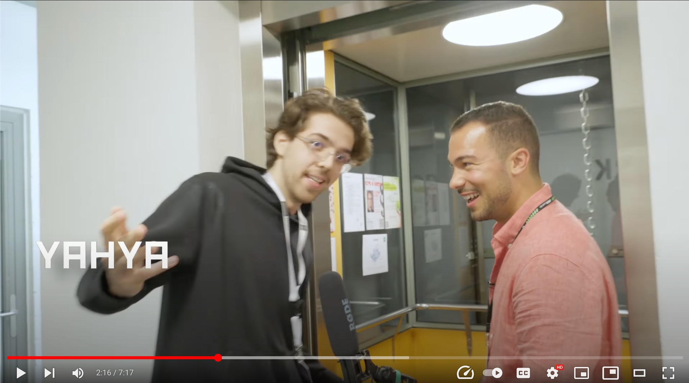

  

  <i>Making speed dating paperless! 💌 🏃🏻💨</i>

For a super short summary - check out this [elevator pitch](https://www.youtube.com/watch?v=n2XdwmY_asM&t=133s):

<a href="https://www.youtube.com/watch?v=n2XdwmY_asM&t=133s">
  

    
  

</a>

Also this [mockup](/documentation/figma%20mockups/V3/matchy%20V3.pdf) gives you a good idea of where we're currently at.
    

## What is speed dating?

Speed dating doesn't happen online!  
It is an organized social event in which participants have one-on-one conversations in person, which are typically limited to less than ten minutes, for the purpose of meeting people they would like to date or befriend.

Here's how it works: When you arrive at the event, a host will sign you up and you will receive a card with your name on it.  
There will be two rows sitting in front of eachother at tables and one these rows will remain seated while the other one rotates about every 3-4 mins. Think of the dates as mini introductions.  
You will use your card to mark down if you are interested in the people you meet.

After the event, each of the participants will give their cards to the host to process. The host will then contact each person individually and send them their matches' contact data.

Enough said. See what it's like to participate in such an event for yourself in this [short demo](https://www.youtube.com/watch?v=p-3cmlPnx0s&t=9s).
    

## How are we improving speed dating?

No more paperwork! With our app: 

- the participants can focus on what matters most: making fun experiences and lasting relationships instead of fiddling around with paper. Also they don't have to wait days until their matches get evaluated by the host anymore.

- the event hosts no longer have to print any cards, use a clock to time the dates or spend countless hours after the events determining the matches and contacting the participants.
  
Evaluating the matches is very time consuming and is the most expensive part of throwing these events.

  
 <i> How expensive? Let's do the math! </i> 

  > Let's assume that we have $n$ participants, split into two groups. For example, 40 participants in total, of which there are 20 in each group.
  > Each participant speed-dates everyone from the other group and fills out their cards as they go along. This gives you $(n)$ 40 cards, each with $(\frac{n}{2})$ 20 reviews.
  >
  > Now, when going through a single card, the host will check if the participant liked the other one. If yes, time to search for their card, and check if they also liked our participant. Then we need somewhere between 0 and $(\frac{n}{2})$ 20 card comparisons to determine the matches for a *single* person. And finally, for each match, all the contact information needs to be manually noted down, and sent to our participant.
  >
  > Repeat this for every single of the $(n)$ 40 participants, and you have at most $(n \cdot \frac{n}{2})$ 800 card comparisons to determine all the matches.
  > 
  > Now assuming that we do this as efficient as possible by iterating through each date that happened at the event once instead of twice from both sides (in the description above we iterated through the people, not the dates) we still have $((\frac{n}{2})^2)$ comparisons - in our example this would mean the host has to do 400 comparisons for just 40 participants which is still very time consuming.
  > 
  > But we also have the option to disable groups altogether which enables all participants to date each other.   In this case the number of comparisons would be a lot higher. If iterating by people we would require $(n \cdot (n-1))$ 1560 comparisons and if iterating by dates we would require a grand total of $({\sum}_{i = 0}^{n-1}i = \frac{n(n+1)}{2} - n)$ 740 comparisons.

That's why – after some non profits reached out to us and told us how desperately they need this app – we decided to get our hands dirty and help them out.

  
 <i> Some of our potential clients from Vienna. </i> 

  > - https://www.meetup.com/speed-friending-events/ (over 8800 members)
  > - https://esnuniwien.com/events/speedfriending-esn-1
  > - https://events.htu.at/events/d58a7134-469b-4528-bc4a-dca2e7b1fa74
  > - https://www.wien.gv.at/video/1482/Speeddating-unter-Pensionisten
  > 
  > (But effectively anyone can use it to throw their own event!)
  

   

---
<i> ⚠ Project not under active development - only active maintenance ⚠ </i>

Thanks for helping us develop this app so far! We've reached a state with our MVP that we are pretty satisfied with. At this point we are just polishing the app, fixing minor mistakes, throwing events in cooperation with the FsWInf @ TU Wien, gathering user feedback to determine whether there is serious potential in this app and whether we want to move post-MVP from february 2023.

If so, we will recreate the app based on our learnings, with a completely new technology stack (this time with middleware such that our project can actually scale well and is not just a prototype for fun).

Until then: Enjoy!
